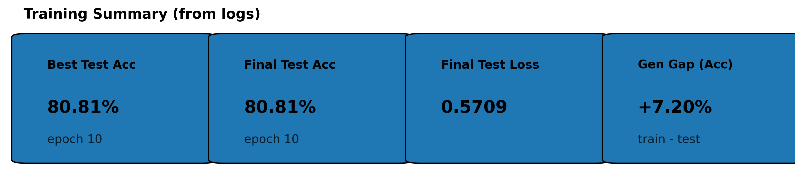
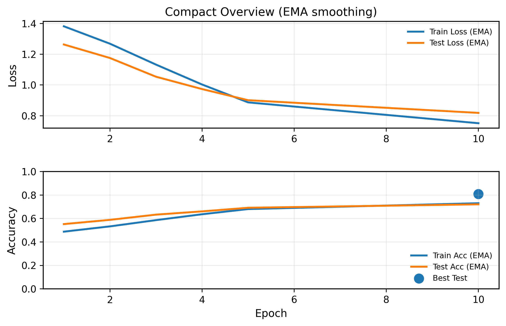

# PyTorch CNN Architecture Library

Modüler PyTorch implementasyonları, teorik dokümantasyon ve kontrollü deneysel protokoller ile
**Convolutional Neural Network (CNN)** mimari bileşenlerini analiz etmek üzere tasarlanmış
bir **mimari araştırma kütüphanesi**.

Bu depo, son kullanıcıya hazır modeller sunmayı amaçlamaz.  
Temel hedef, CNN performansını belirleyen **mimari yapı taşlarını izole etmek**, bu yapı taşlarının
öğrenme dinamiklerine, temsil gücüne ve hesaplama maliyetine etkilerini deneysel olarak incelemektir.

---

## 1. Amaç

Modern CNN performansı yalnızca ağ derinliği veya parametre sayısı ile açıklanamaz.  
Çoğu durumda performans artışı, aşağıdaki mikro mimari kararlarından kaynaklanır:

- Konvolüsyon varyantı seçimi
- Normalizasyon stratejisi
- Aktivasyon fonksiyonu
- Residual blok tasarımı
- Attention mekanizması

Bu proje, bu bileşenleri **bağımsız modüller** olarak ele alır ve
kontrollü deneyler ile etkilerini karşılaştırır.

---

## 2. Proje Kapsamı (Architecture Coverage)

### 2.1 Convolution Geliştirmeleri

- Depthwise Separable Convolution
- Pointwise Convolution
- Inverted Bottleneck Block
- Ghost Convolution
- Dilated Convolution
- Deformable Convolution
- Shift Convolution
- Octave Convolution
- Dynamic Convolution
- RepVGG Re-parameterizable Convolution
- Coordinate Convolution
- Grouped Convolution

### 2.2 Residual / Blok Yapıları

- Basic Residual Block
- Pre-activation Residual Block
- Wide Residual Block
- ResNeXt Grouped Convolution Block
- Bottleneck with Expansion
- Squeeze-and-Excitation Residual Block
- Residual + Attention Fusion Pattern

### 2.3 Attention Mekanizmaları

- SE (Squeeze-and-Excitation)
- ECA (Efficient Channel Attention)
- CBAM
- Coordinate Attention

### 2.4 Normalizasyon Katmanları

- Layer Normalization
- Group Normalization
- Instance Normalization
- Batch Renormalization
- Sync Batch Normalization
- Weight Standardization
- Frozen BatchNorm

### 2.5 Aktivasyon Fonksiyonları

- LeakyReLU
- PReLU
- GELU
- SiLU (Swish)
- HardSwish

---

## 📊 **Referans Deney Konfigürasyonu**

Aşağıdaki sonuçlar, kütüphanedeki modüllerin birlikte kullanıldığı tek bir referans deney konfigürasyonundan elde edilmiştir

- **Convolution Layer:** Dynamic Convolution
- **Normalization:** Batch Normalization (BN)
- **Activation Function:** ReLU
- **Residual Structure:** Pre-activation residual pattern
- **Attention Mechanism:** Channel + Spatial attention fusion
- **Feature Aggregation:** Global Average Pooling
- **Classifier Head:** Fully Connected Linear Layer
- **Training Protocol:** CIFAR-10, standart veri artırma ve sabit deney ayarları

Bu görseller, eğitim sürecinin genel davranışını ve modelin kararlılığını özetlemek amacıyla sunulmuştur.

- **Yapılan çalışmayı derlemek için aşağıdaki terminal komutlarını kullanınız.**

Train:
`cd Torch_CNN
python -m torch_cnn.scripts.train --epochs 10 --conv dynamic --norm bn --act relu --attn cbam`

Eval : `python scripts/eval.py --ckpt results/checkpoints/reference_net_last.pt`

<p align="center">
  
  
</p>

---

## 🔬 Comparisons Index (Controlled Experiments)

Bu repodaki tüm kontrollü kıyas notebook’ları ilgili modül klasörleri altında bulunur.  
Standart kural: Karşılaştırmalar **`to_compare/`** veya **`_comparisons/`** klasörlerinde yer alır.

### ⚡ Activation Functions

- [Swish vs HardSwish](./Torch_CNN/activation_functions/Egde/HardSwish/to_compare/swish_vs_hardswish.ipynb)
- [Sigmoid vs HardSigmoid](./Torch_CNN/activation_functions/Egde/HardSigmoid/to_compare/sigmoid_vs_hardsigmoid.ipynb)
- [ReLU vs PReLU vs LeakyReLU vs SiLU](./Torch_CNN/activation_functions/Core/_comparisons/relu_prelu_leakyrelu_silu_compare.ipynb)

### 🧩 Convolution Modules

- [12 Conv Block Benchmark](./Torch_CNN/convolution_modules/_comparisons/conv_benchmark_12_blocks.ipynb)

### 🧠 Normalization Layers

- [Normalization Layer Comparisons](./Torch_CNN/normalization_layers/models/Norm_Karşılaştırmaları.ipynb)

📌 Not: Her karşılaştırma aynı backbone, aynı optimizer, aynı veri bölünmesi ve aynı seed ile çalıştırılmış kontrollü deneylerdir.

---

## 3. Mimari Tasarım Yaklaşımı

Bu kütüphane, CNN’leri tek parça modeller olarak değil,
**birbirinden ayrıştırılmış mimari bileşenlerin birleşimi** olarak ele alır.

Her bileşen:

1. Teorik olarak açıklanır
2. PyTorch modülü olarak uygulanır
3. Standart deney protokolü ile değerlendirilir

Bu yaklaşım, mimari seçimleri sezgisel değil, **veriye dayalı** hale getirir.

---

## 4. Klasör Yapısı

Her konu aşağıdaki standart klasör yapısını takip eder:

```text
topic_name/
│
├── notes/ → Teorik açıklamalar ve notebook’lar
├── models/ → PyTorch implementasyonları (import edilebilir)
├── to_compare/ → Karşılaştırmalı deney konfigürasyonları
└── assets/ → Grafikler, diyagramlar ve deney çıktıları
```

| Klasör     | Rol                                         |
| ---------- | ------------------------------------------- |
| notes      | Matematiksel ve kavramsal açıklamalar       |
| models     | Tekrar kullanılabilir PyTorch modülleri     |
| to_compare | Kontrollü karşılaştırma ortamı              |
| assets     | Sonuç görselleştirme ve analiz materyalleri |

---

## 5. Deneysel Protokol

Mimari karşılaştırmalar şu sabitler korunarak yürütülür:

- Aynı dataset
- Aynı eğitim pipeline’ı
- Aynı random seed
- Aynı veri artırma ayarları

Bu sayede performans farkları yalnızca **mimari bileşen değişiminden** kaynaklanır.

Değerlendirilen metrikler:

- Accuracy
- Loss
- Parametre sayısı
- FLOPs
- Latency (isteğe bağlı)

---

## 6. Tasarım İlkeleri

- Modülerlik
- Tekrarlanabilirlik
- Deneysel doğrulama
- Kod ve teori bütünlüğü

---

## 7. Hedef Kitle

Bu proje aşağıdaki kullanıcılar için uygundur:

- CNN mimari tasarımı üzerine çalışan araştırmacılar
- Derin öğrenme alanında ileri seviye öğrenme yapmak isteyenler
- Akademik projeler geliştiren öğrenciler
- Özgün model mimarisi geliştirmek isteyen mühendisler

---

## 8. Uzun Vadeli Hedef

Bu depo, CNN mimari bileşenleri için
**deneysel referans kütüphanesi** oluşturmayı amaçlar.

Amaç, mimari kararları sezgiye değil,
**ölçülebilir deney sonuçlarına dayandırmaktır**.

**Bu proje bir model koleksiyonu değil, bir CNN mimari araştırma laboratuvarıdır.**

---

# 📦 Requirements

Python 3.10+ önerilir.

- **pip install -r requirements.txt**

CUDA kullanıyorsanız:

- **pip install torch torchvision torchaudio --index-url https://download.pytorch.org/whl/cu121**

---

# ⚡ Quick Start

```text
git clone https://github.com/huseyin-dgn/pytorch-cnn-architecture-library
cd Torch_CNN
pip install -r requirements.txt
python -m torch_cnn.scripts.train --epochs 10 --conv dynamic --norm bn --act relu --attn cbam
```
